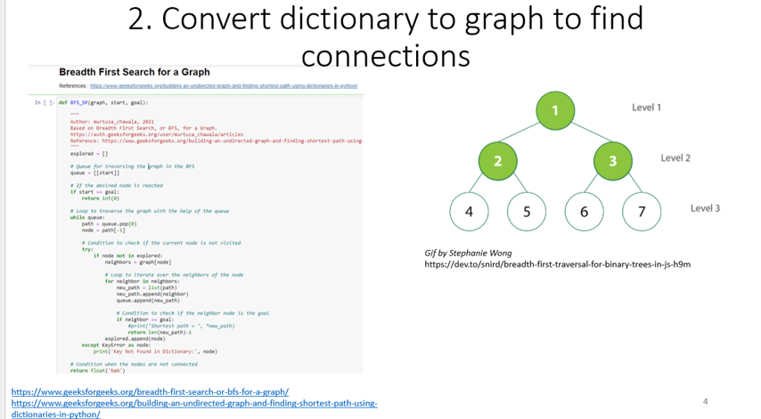
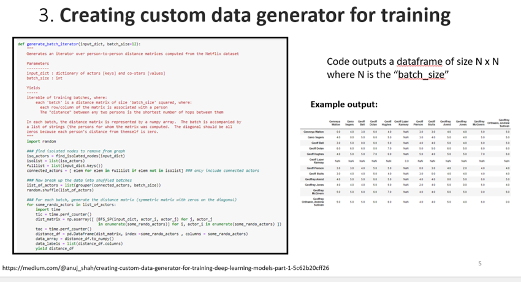
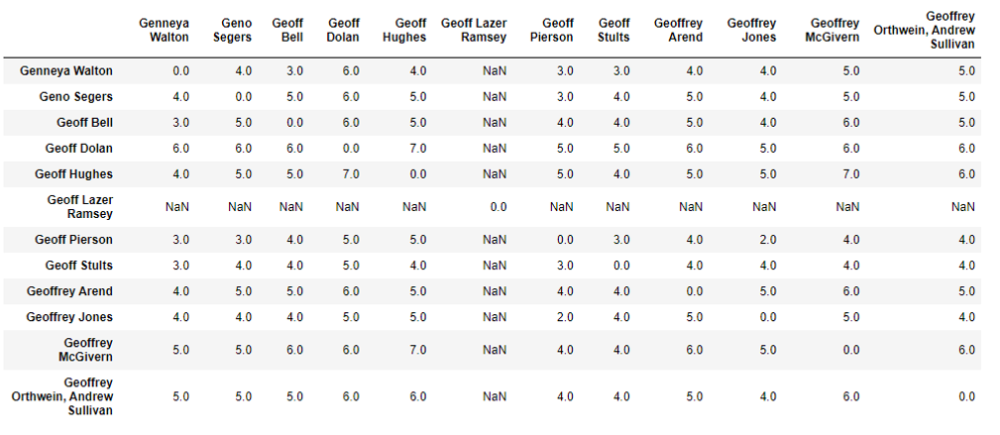
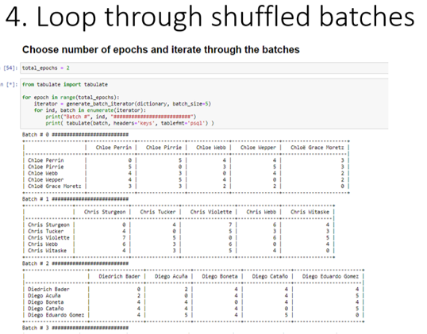

# Graph approach to Solving the “Six Degrees of Kevin Bacon” problem!


(Image Credit: https://www.iceinstitute.org/blog/2019/4/1/six-degrees-of-kevin-bacon-education-edition)

## Objective

Create a data iterator meant to make data available to a hypothetical neural network training process.  

This hypothetical neural network would learn a person-vector embedding based on how many links are needed to get from that person to other person, as in the game, “Six Degress of Kevin Bacon.”


## Dataset

Dataset: Netflix Movies and TV Shows
Link: https://www.kaggle.com/shivamb/netflix-shows


## Background on this Project

I naively implemented these technques without using NLP techniques such as imputation, feature engineering, and text pre-processing. The goal is to "update" this work using the NLP techniques that I've since learned. 

## Overview of my First Approach

## Step 1. Convert CSV to Dictionary


## Step 2. Load dictionary to Graph to create distance matrix for actors and directors



## Step 3. Data Generator




Example for Distance Matrix Size of 12:

```
dist_mat = generate_batch_iterator(dictionary, size=12)

next(dist_mat)

```




## Step 4. Loop through shuffled batches




## Future Directions

- [ ] Improve the efficiency of the batching (using DataLoader)
- [ ] Implement NLP techniques (lower case, spelling check, stemming, lemmatization, vector embedding, etc.)


