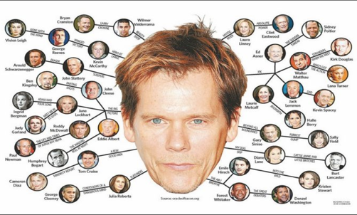
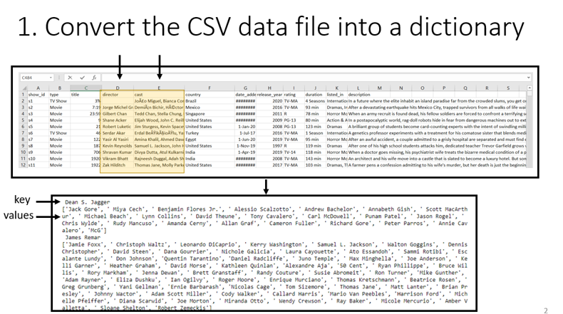
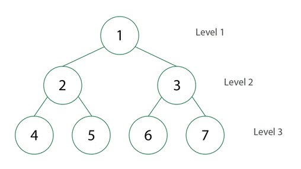

# Graph approach to Solving the “Six Degrees of Kevin Bacon” problem!

(Image Credit: https://www.iceinstitute.org/blog/2019/4/1/six-degrees-of-kevin-bacon-education-edition)

## Objective

Create a data iterator meant to make data available to a hypothetical neural network training process.  

This hypothetical neural network would learn a person-vector embedding based on how many links are needed to get from that person to other person, as in the game, “Six Degress of Kevin Bacon.”

## Dataset

Dataset: Netflix Movies and TV Shows
Link: https://www.kaggle.com/shivamb/netflix-shows

## Background
=======
## Overview 

## Step 1. Convert CSV to Dictionary

## Step 2. Load dictionary to Graph to create distance matrix for actors and directors

3. Iterate through batches of the data, eventually for training a neural network

## Future Directions

